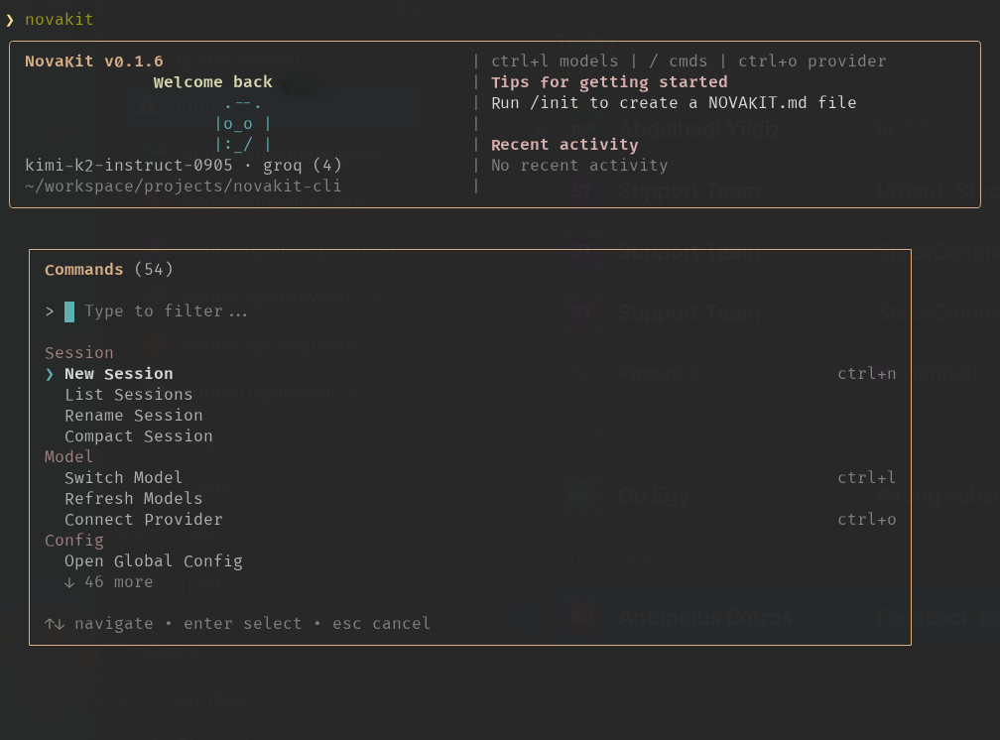

# NovaKit CLI

> AI coding agent in your terminal. Multi-provider support, checkpoints & instant rewind, semantic code search.

[](https://www.npmjs.com/package/novakit-cli)
[](https://www.npmjs.com/package/novakit-cli)
[](https://nodejs.org)
[](LICENSE.md)

<p align="center">
  
</p>

## Why NovaKit CLI?

- **10x more tokens** than competitors at half the price
- **Multi-provider support** — Use your own API keys or our bundled access
- **Checkpoints & instant rewind** — Press `Esc+Esc` to undo any change
- **Semantic code search** — Vector-indexed codebase for intelligent context
- **LSP integration** — Go-to-definition, find references, hover info
- **Background tasks** — Spawn parallel agents for concurrent work

## Installation

```bash
npm install -g novakit-cli
```

Requires Node.js 18.0.0 or higher.

## Quick Start

```bash
# Option 1: Use GitHub Copilot (free with GitHub account)
novakit auth login --provider github-copilot

# Option 2: Use your own API key
novakit provider add openai --api-key YOUR_KEY

# Option 3: Use NovaKit bundled access (paid plans)
novakit auth login

# Start coding
novakit
```

## Features

### Multi-Provider Support

Connect to any AI provider with your own keys:

| Provider | Auth | Default Model |
|----------|------|---------------|
| OpenAI | API Key | gpt-4o-mini |
| Anthropic | API Key | claude-sonnet-4-5 |
| GitHub Copilot | OAuth | grok-code-fast-1 |
| OpenRouter | API Key | gpt-4o-mini |
| Groq | API Key | kimi-k2-instruct |
| Google AI | API Key | gemini-2.0-flash |
| NovaKit | API Key | gpt-oss-120b |

Or add any OpenAI-compatible endpoint (Ollama, local models, etc.):

```bash
novakit provider add my-local --base-url http://localhost:11434/v1
```

### Three Approval Modes

Control how much autonomy the agent has:

| Mode | Description | Shortcut |
|------|-------------|----------|
| **read-only** | Only exploration tools (read, search, analyze) | `Tab` |
| **auto** | Confirms file changes and shell commands (default) | `Tab` |
| **full** | Auto-approve all operations | `Tab` or `--yolo` |

### Checkpoints & Undo/Redo

Every file change creates an automatic checkpoint:

- `Esc Esc` — Instant rewind to last checkpoint
- `Ctrl+Z` — Undo last change
- `Ctrl+Y` — Redo
- `/checkpoint` — Create manual checkpoint
- `/checkpoint-list` — View all checkpoints

### Semantic Code Search

Vector-indexed codebase for intelligent context retrieval:

```bash
novakit index build              # Index your codebase
novakit index search "auth flow" # Search semantically
```

The agent automatically uses the index to find relevant code.

### LSP Integration

Built-in Language Server Protocol support:

- **Go-to-definition** — Navigate to symbol definitions
- **Find references** — Find all usages of a symbol
- **Hover info** — Get type information and documentation
- **Diagnostics** — Compiler errors and linting issues

Supports: TypeScript, JavaScript, Python, Go, Rust, and more.

### Background Tasks (Subagents)

Spawn parallel agents for concurrent work:

```
/spawn Write unit tests for the auth module
/spawn Document the API endpoints
/tasks                    # Monitor running tasks
```

Up to 3 concurrent background tasks.

### MCP Integration

Extend with Model Context Protocol servers:

```bash
# Configure in ~/.novakit/mcp.json
novakit mcp connect github
/mcp-status              # Check connected servers
```

### Custom Commands & Agents

Define your own slash commands and specialized agents:

```json
// ~/.novakit/commands.json
{
  "commands": {
    "review": {
      "type": "prompt",
      "template": "Review this code for security issues: {{input}}"
    }
  }
}
```

## Commands

### CLI Commands

```bash
novakit                         # Start interactive chat
novakit chat -m claude-sonnet   # Use specific model
novakit chat -p "Fix the bug"   # One-shot prompt
novakit session list            # List sessions
novakit session resume <id>     # Resume a session
novakit config list             # Show configuration
novakit index build             # Build vector index
novakit doctor                  # Run diagnostics
```

### In-Chat Commands

| Command | Description |
|---------|-------------|
| `/help` | Show all commands |
| `/switch-model` | Change AI model |
| `/new-session` | Start fresh session |
| `/undo`, `/redo` | Undo/redo changes |
| `/checkpoint` | Create checkpoint |
| `/rewind` | Rewind to checkpoint |
| `/spawn <prompt>` | Start background task |
| `/tools` | Manage available tools |
| `/memories` | View saved memories |
| `/config-project-init` | Create project config |

## Keyboard Shortcuts

| Shortcut | Action |
|----------|--------|
| `Ctrl+L` | Switch model |
| `Ctrl+N` | New session |
| `Ctrl+O` | Connect provider |
| `Ctrl+Z` | Undo |
| `Ctrl+Y` | Redo |
| `Esc Esc` | Rewind to checkpoint |
| `Tab` | Cycle approval modes |
| `Shift+Tab` | Cycle tool modes (Agent/Review/Plan) |
| `@` | Attach file |
| `#` | Save/attach memory |

## Configuration

### Global Config

```bash
novakit config set defaultModel claude-sonnet-4-5
novakit config set maxTokens 16384
novakit config set autoConfirmWrites true
```

Location: `~/.novakit/config.json`

### Project Config

```bash
novakit config init              # Create .novakit/config.json
```

Project settings override global settings.

### Key Options

| Option | Default | Description |
|--------|---------|-------------|
| `defaultModel` | — | Default model to use |
| `maxTokens` | 16384 | Max tokens per request |
| `maxToolIterations` | 10 | Max tool calls per response |
| `autoConfirmWrites` | false | Skip confirmation for file ops |
| `useVectorIndex` | true | Enable semantic search |
| `approvalMode` | "auto" | Default approval mode |

## Pricing

NovaKit CLI is **free forever** with your own API keys.

For bundled multi-model access without managing keys:

| Plan | Price | What You Get |
|------|-------|--------------|
| **Free** | $0 | BYOK (bring your own keys) |
| **CLI Pro** | $12/mo | 2,000 credits + 500 signup bonus |
| **CLI Team** | $39/mo | 10,000 credits + 3 seats + 1,000 bonus |

Credits work across 50+ models including GPT-5, Claude Opus 4.5, Gemini 2.5 Pro.

[View pricing](https://novakit.ai/pricing)

## Agent Tools

NovaKit CLI includes 15+ built-in tools:

**File Operations:** `read`, `write`, `edit`, `apply_patch`, `glob`, `grep`, `list_directory`

**Execution:** `bash` (with safety filters)

**Web:** `web_search`, `web_fetch`

**Code Intelligence:** `vector_search`, `lsp_goto_definition`, `lsp_find_references`, `lsp_hover`, `lsp_diagnostics`

**Memory:** `save_memory`, `read_memory`

**Vision:** `vision` (analyze images)

## IDE Extensions

NovaKit CLI can run as a JSON-RPC server for IDE integration:

```bash
novakit serve    # Start JSON-RPC server on stdio
```

VS Code and JetBrains extensions coming soon.

## Documentation

- [Getting Started](https://novakit.ai/docs/cli/getting-started)
- [Configuration Guide](https://novakit.ai/docs/cli/configuration)
- [Custom Commands](https://novakit.ai/docs/cli/custom-commands)
- [MCP Integration](https://novakit.ai/docs/cli/mcp)
- [LSP Setup](https://novakit.ai/docs/cli/lsp)

## Support

- [Report a Bug](https://github.com/omer-yld/novakit-cli-public/issues/new?template=bug_report.md)
- [Request a Feature](https://github.com/omer-yld/novakit-cli-public/issues/new?template=feature_request.md)
- [Email Support](mailto:support@novakit.ai)

## Changelog

See [CHANGELOG.md](CHANGELOG.md) for release history.

## License

NovaKit CLI is proprietary software. See [LICENSE.md](LICENSE.md) for details.

---

<p align="center">
  Made with love by the NovaKit team
</p>
